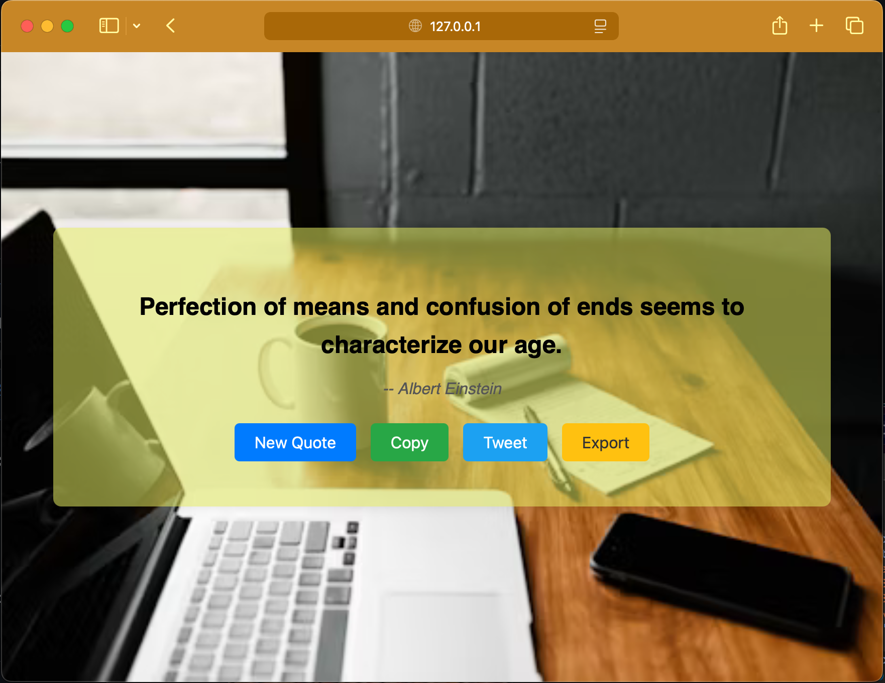
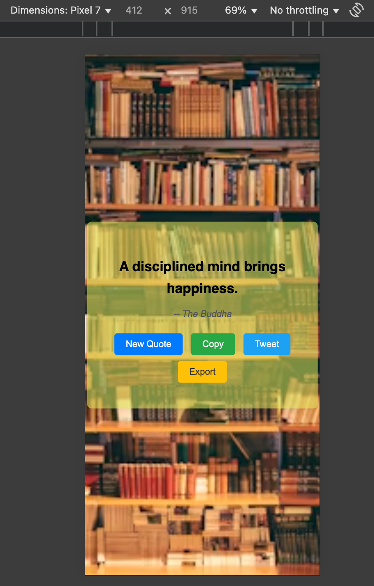

# Random Quotes Generator

A sleek, responsive web application that generates inspiring quotes from famous authors and personalities. With a single click, get a new quote displayed against a beautiful random background.

## Live Link
[click here]()
## Images
<div align="center">
    
    
</div>

## ✨ Features

- **Random Quotes**: Fetch and display random quotes from a vast collection
- **Author Attribution**: Each quote includes the name of its author
- **Copy to Clipboard**: One-click copying of quotes for easy sharing
- **Twitter Integration**: Share your favorite quotes directly on Twitter
- **Export as Image**: Save quotes as images to share on social media
- **Dynamic Backgrounds**: Each quote appears with a unique random background image
- **Responsive Design**: Works seamlessly on desktop, tablet, and mobile devices

## 🛠️ Technologies Used

- **HTML5**: Structure of the web application
- **CSS3**: Styling and animations, including responsive design
- **JavaScript**: Dynamic functionality and API integration
- **FreeAPI.app**: External API for quote generation
- **Font Awesome**: Icons for enhanced user interface
- **Google Fonts**: Typography enhancements

## 📋 Installation

1. **Clone the repository**
   ```
   git clone https://github.com/suuumans/random-quotes.git
   ```

2. **Navigate to the project directory**
   ```
   cd random-quotes
   ```

3. **Open in browser**
   - Simply open the `index.html` file in any modern web browser
   - No additional dependencies or installations required

## 🚀 Usage

1. **View Random Quotes**
   - When the page loads, a random quote with author attribution is displayed
   - Click the "New Quote" button to generate another random quote

2. **Copy Quote**
   - Click the copy icon to copy the current quote to your clipboard
   - A notification will confirm successful copying

3. **Share on Twitter**
   - Click the Twitter icon to share the current quote on your Twitter account
   - The quote and author will be pre-populated in your tweet

4. **Export as Image**
   - Click the image icon to download the current quote as an image
   - The image includes the quote, author, and background

## 👥 Contributing

1. Fork the repository
2. Create your feature branch (`git checkout -b feature/AmazingFeature`)
3. Commit your changes (`git commit -m 'Add some AmazingFeature'`)
4. Push to the branch (`git push origin feature/AmazingFeature`)
5. Open a Pull Request

## 🔌 API Information

This application uses the [FreeAPI.app](https://freeapi.app) service to fetch random quotes.

- **API Endpoint**: `https://api.freeapi.app/api/v1/public/quotes/random`
- **Response Format**: JSON containing quote text and author information
- **Rate Limits**: Please refer to the FreeAPI documentation for current rate limits
- **No API Key Required**: The public endpoint used in this project doesn't require authentication

## 📝 License

This project is licensed under the MIT License - see the LICENSE file for details.

---

[Suman Sarkar](https://x.com/suuumans)